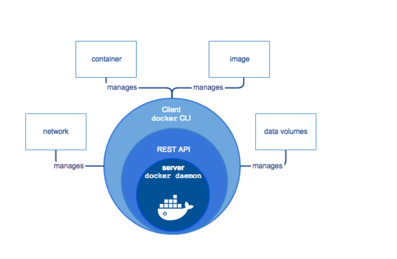
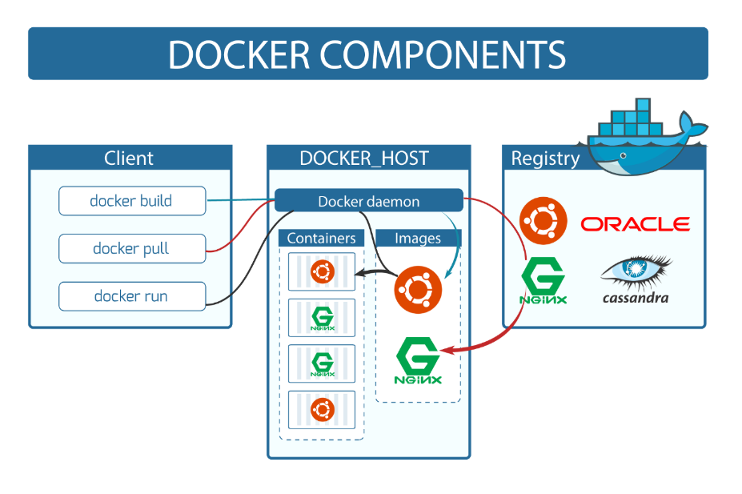

### Why docker/containers are important for few reasons

Kubernetes/Container orchestration
Running processes in isolated environments
Starting projects/auxilary services locally

### Containarization

Containers are a way to package and distribute software applications in a way that makes them easy to deploy and run consistently across different environments. They allow you to package an application, along with all its dependencies and libraries, into a single unit that can be run on any machine with a container runtime, such as Docker.

Why containers

- Everyone has different Operating systems
- Steps to run a project can vary based on OS
- Extremely harder to keep track of dependencies as project grows

Benefits of using containers

- let you describe your configuration in a single file
- can run in isolated system
- makes local setup of OS projects a breeeze
- makes installing auxilary services and databases eary

** Docker is not the only way to make container , docker is most popular containerization tool contaier run time **

## Containerizations vs Virtualization

An application on a Virtaul Machine requires a guest OS and thus an underlying hypervisor to run. Hypervisor is used to create multiple machones on a host operating system and manages virtual machines. These virtual machines have their own operating system and do not use the host's operating system. They have some space allocated.

In software world, containerization is an efficient method for deployign applications. A container encapsulaetd ans application with its own operating environment. It can be placed on any hose machine without special configuration, removing the issues of dependencies.

Virtual machines is hardware virtualization, whereas containerization is OS virtualization. In comparison, virtualization is creation of a virtual version of something such as an operating system, server of a storage device or network resources. Containerization is lightweight approach to virtualization.

### Running containers

On linux , linux container ,
windows : Docker desktop + wsl
mac : Virtual machines + docker desktop

## What is Docker

Docker is a container platform that allows you to build, test and deploy applications quickly. A developer defines all the applications and it’s dependencies in a Dockerfile which is then used to build Docker images that defines a Docker container. Doing this ensures that your application will run in any environment.

## Why use Docker

Using Docker can help you ship your code faster, gives you control over your applications. You can deploy applications on containers that make it easier for them to be deployed, scaled, perform rollbacks and identify issues. It also helps in saving money by utilizing resources. Docker-based applications can be seamlessly moved from local development machines to production deployments. You can use Docker for Microservices, Data Processing, Continuous Integration and Delivery, Containers as a Service.

## Docker Architecture

## Docker runtime

- runc --> to work with operating system starts and stops contianer
- containerd --> managing runc , interacting container with the network

## Docker Engine , Daemon

Docker daemon listens to to the API requests being made through the Docker client and manages Docker objects such as images, containers, networks, and volumes.

## Docker client

This is what you use to interact with Docker. When you run a command using docker, the client sends the command to the daemon, which carries them out. The Docker client can communicate with more than one daemon.

## Docker cli

- go to docker cli via command docker
- docker --version

# Orchrestration Engine

## Docker registries

This is where Docker images are stored. Docker Hub is a public registry that anyone can use. When you pull an image, Docker by default looks for it in the public registry and saves the image on your local system on DOCKER_HOST. You can also store images on your local machine or push them to the public registry.

## Dockerfile

Describes steps to create a Docker image. It’s like a recipe with all ingredients and steps necessary in making your dish. This file can be used to create Docker Image. These images can be pulled to create containers in any environment. These images can also be store online at docker hubs. When you run docker image you get docker containers. The container will have the application with all its dependencies.

# Docker cli commands

### docker pull jdk17

Only download the jdk17 images

### docker run -it ubuntu

- if image found is runs the new container else it downloads image from dockerhub
- docker run -d -p 4000:27017 mongo
- -p for port mapping runs mongo on port 4000
- -d for detched mode (terminal becomes free)

- docker container ls
  (shows all containers )
- docker container ls -a
  (shows all containers even stopped ones)

Every container has its own IP address and a unique MAC address. Name and id

### docker inspect <container_id or name>

Gives all information of container

### docker ps

### docker ps -a

### docker start docker_name

(starts the specified container )

### docker stop docker_id

(stops the specified container )

### docker run docker_name

(run a new docker container)

### docker exec <container_id> -it bash

### docker exec <container_name> <command_name>

docker exec container_name ls // list all files in container without starting the container

### docker exec -it <container_name> /bin/bash // start bash shell inside a running container and run it as interactive session

### docker run -d alpine

runs the container in detached mode, background

### kil docker container

- docker kill <containerid>
- docker kill 243948234324

- docker rm <containerid> /// removes container
- docker rmi <image name>

### Port mapping

suppoose i run dovker run -it df/mynodeapp ==> you see server running on port say 3000

now on your device if you go to localhost:3000 you willnot be able to access the application that is running inside the container.

to access in the required port you have to do port mapping g

### docker run -it -p <host_port>:<container_port> <image_name>

- start bash shell inside a running container and run it as interactive session with host machine on specified ports.
- docker run -it -p 3000:3000 piyushgargdev/mynodeapp ==> you see server running on port say3000 in localhost

Sometimes we need to expose two port

### docker run -it -p 8025:8025 -p 1025:1025 mailhog/mailhog

### Passing environment varaibles to docker container to pass extra variables

docker -d -p 1025:1205 -e kye=value -e key=value mailhog/mailhog

### Docker commits

Statement - i have ubuntu_real container running via ubuntu image on my machine and now i want to create another docker container from this existing one and call it ubuntu_committed with some changes say add names.txt and write something to it . How can i do that ?

docker run -it --name pulled_ubuntu ubuntu
touch cat.txt
echo "Hey my name is sachin" >> cat.txt
cat cat.txt
exit
docker ps -a
//docker comit -m "comit message" <original_containerid> <new_image_name-version>
docker commit -m "added cat.txt" c36a0d9c9100 modified_ubuntu:1.01
docker images
docker run -it modified_ubuntu
