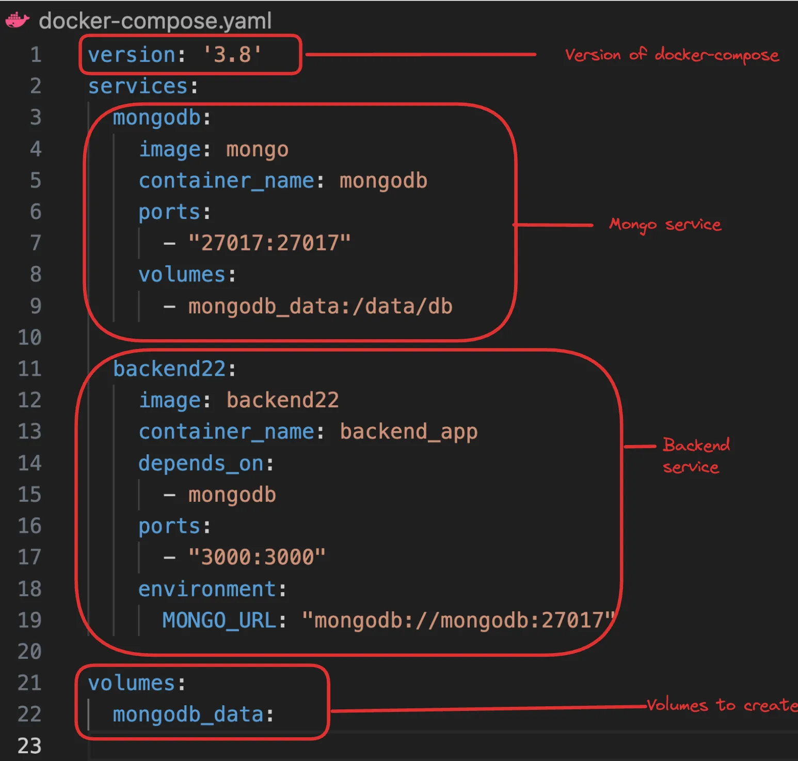

# WHY  docker-compose.yml

Docker Compose is a tool designed to help you define and run multi-container Docker applications. With Compose, you use a YAML file to configure your application's services, networks, and volumes. Then, with a single command, you can create and start all the services from your configuration.


## Problem statement 
suppose you want to run a node.js application that your friend shared you via docker contianer , node.js application also needs mongoose . 
SO you wanna run mongodb in another container 


# Before docker-compose 
- create a network 
```
docker network create my_custom_network
```

- create a volume 
```
docker volume create volume_database
```

- start mongo container (no port mapping as we don't need to expose mongodb to host machine , port is for that use , two contianer in a network can talk without port mapping )
```
docker run -d -v volume_database:/data/db --name mongo --network my_custom_network  mongo
```

- start backend contianer 
connection url looks like `mongodb://mongo:27017/myDatabase`
```
docker run -d -p 3000:3000 --name backend --network my_custom_network backend
```

# After docker-compose 
Create docker-compose.yml 

- start the compose 
```
docker-compose up
```
- stop everything (including volumes)
```
docker-compose down --volumes
```


```
version: "3.8"
services:
  mongodb:
    image: mongo
    container_name: mongodb
    ports:
      - "27017:27017"
    volumes:
      - mongodb_data:/data/db

  backend:
    image: backend
    container_name: backend_app
    depends_on:
      - mongodb
    ports:
      - "8000:8000"
    environment:
      MONGO_URL: "mongodb://mongodb:27017"

volumes:
  mongodb_data:

```