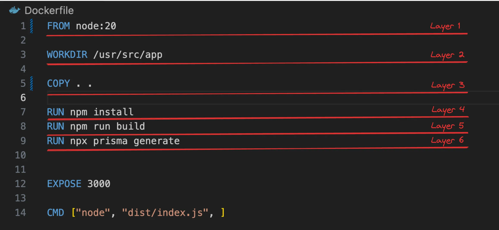
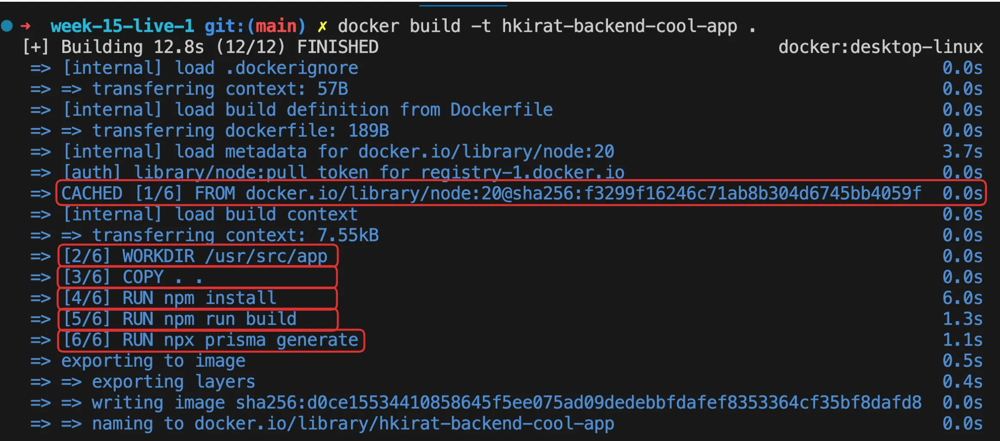
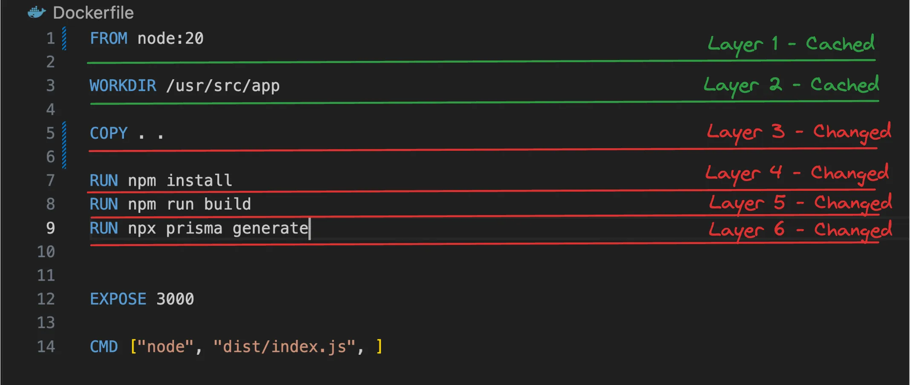
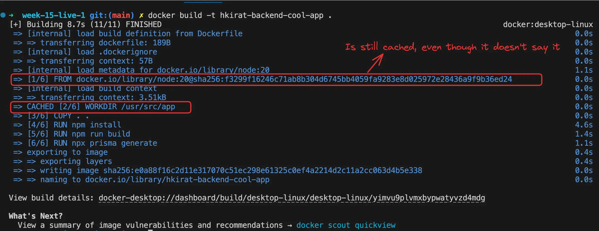
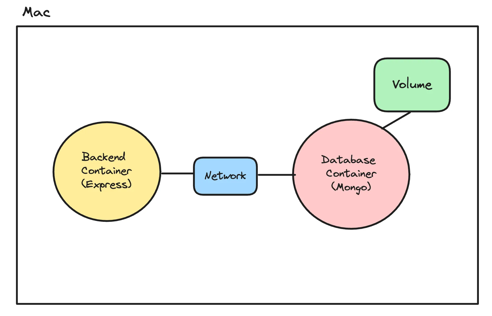
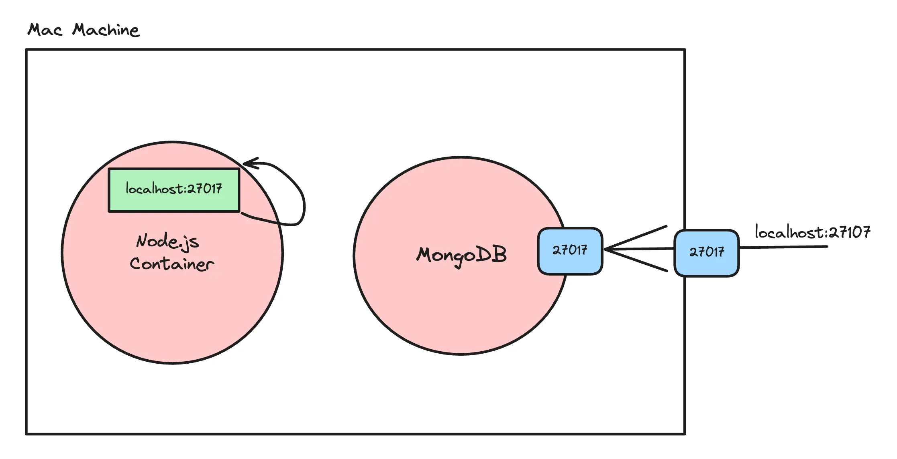

# Layers in Docker 
In docker ,  layers are a fundamental part of the image architecture that allows Docker to be efficient, fast, and portable. A Docker image is essentially built up from a series of layers, each representing a set of differences from the previous layer.

### How layers are made - 
1. Base Layer: The starting point of an image, typically an operating system (OS) like Ubuntu, Alpine, or any other base image specified in a Dockerfile.

2. Instruction Layers: Each command in a Dockerfile creates a new layer in the image. These include instructions like RUN, COPY, which modify the filesystem by installing packages, copying files from the host to the container, or making other changes. Each of these modifications creates a new layer on top of the base layer.

3. Reusable & Shareable: Layers are cached and reusable across different images, which makes building and sharing images more efficient. If multiple images are built from the same base image or share common instructions, they can reuse the same layers, reducing storage space and speeding up image downloads and builds.

4. Immutable: Once a layer is created, it cannot be changed. If a change is made, Docker creates a new layer that captures the difference. This immutability is key to Docker's reliability and performance, as unchanged layers can be shared across images and containers.


# Docker layers 


# Caching docker layer 



For the very first time may be no layer are cached as they are not used previously 
But during second docker build -t image_name , the layers which were created in previous docker builds will be reused and cached for future use .

**Layers can be build accross Dockerfile , meaning in different directly in same machine** 


## Now that all layers are cached , what if change is made to index.ts 
COPY . . layer changes 
If a layer is not cached then the layers below it are also not cached 



## Change package.json maybe add new dependency 
still COPY . . layer changes and base image and workdir is still cached 


# How often npm i change , how often package.json change 
What is the problem with this dockerfile 


What do i do in general , install whatever dependencies is need for project and change code freqentyly 
As per the above docker file , everytime code changes the layer COPY is uncached and hence all layers below it are also uncached 
SO everytime code change npm install re-runs 

Better Dockerfile
```
FROM node:16-alpine

WORKDIR /app

COPY package* .
COPY ./prisma .

RUN npm install
RUN npx prisma generate 


COPY . . 

RUN npm run build 

EXPOSE 3000 

CMD ["node","dist/index.js"]
```

SO anytime the code changes unless dependencies or prisma folder don't change , command npm install is cached 

Try changing code index.js and see how it works 
Also try changing package.json and see what happens


# Networks and volumes 


Volumes 

## Without volumes 
Try running a mongo image via docker and connect to database may be nodejs application or mongodb 
Add new entry to database 
Stop the docker container 
Restart it 
Now you see all the database and entries in it are deleted as they were not saved anywhere else

**So To persist data across docker restart we use volumes** 

## With Volumes 
create a volume 

- docker volume ls 

- docker volume create <sample_volume>

Mount the folder in mongo which actaully stores the data to this volume 

- docker run -v sample_volume:/data/db -p 28000:27017 --name  volumedb mongo 

Try same thing again insert data to database  via nodejs or compass 
Restart the container 
The data persists !!!!

Many docker container can mount over same volume 


# Network 
In Docker, a network is a powerful feature that allows containers to communicate with each other and with the outside world.

Docker containers can’t talk to each other by default.

localhost on a docker container means it's own network and not the network of the host machine




Simulating the problem 

Try running two docker container 

1 mongodb 
- docker run -v sample_volume:/data/db -p 28000:27017 --name  sampledb mongo 
no need of volume actaully 

2 Start a nodejs application use mongodb 
set connection string to "mongodb://localhost:28000/volumedb"
Dockerize the nodejs application and start the nodejs applicatio via docker 

When the nodejs application tries to connect to mongodb  database running in another docker container in same machinie via "mongodb://localhost:28000/volumedb" 
The error is "Error connecting to db "

WHy is that , because two docker container cannot talk to each other 

## We create a network to solve this problem 

- docker network ls 
- docker run -d -v sample_volume:/data/db --name finaldb --network my_custom_network -p 28000:27017 mongo 

- async function connect() {
  await mongoose.connect("mongodb://finaldb:28000/mydatabase");
}
connect()
  .then(() => console.log("Connected to db "))
  .catch(() => console.log("Error connecting to db"));

- docker build -t  node_image .

-docker run -p 8000:8000 --network my_custom_network node_image


So since two contianer on same network so database connection works 